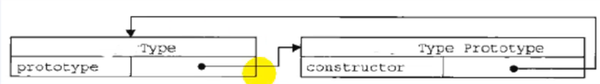
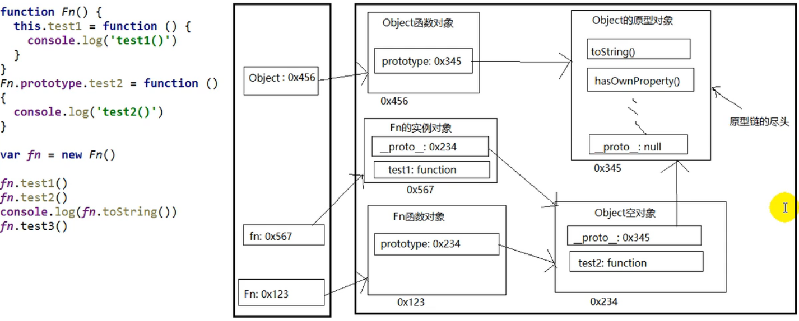
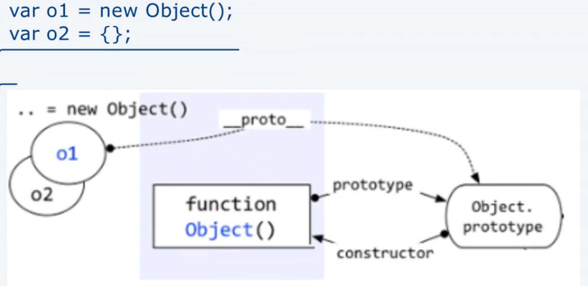
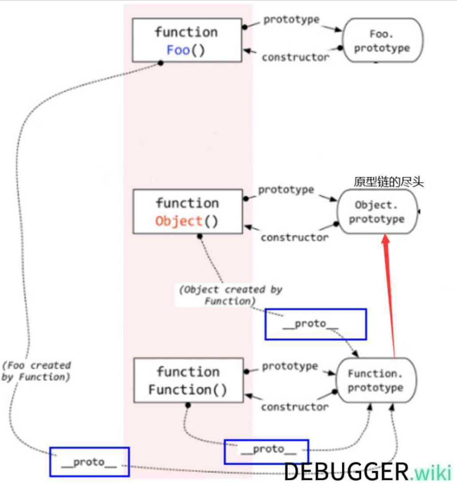
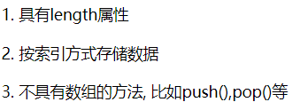
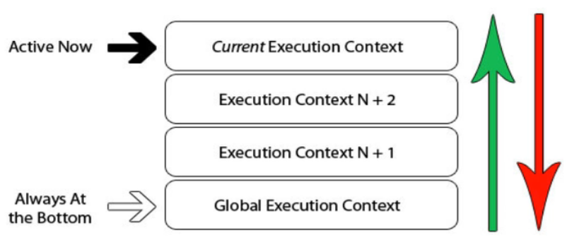

第一章 基础总结深入

## 1.1 数据类型

### 1.1.1 分类

#### 基本(值)类型

1. String：任意字符串
2. Number：任意的数字
3. boolean：true / false
4. undefined：undefined
5. null：null

#### 对象(引用)类型

1. Object：任意对象
2. Function：可以执行的对象
3. Array：具有 `数值下标、内部数据有序的` 特点的对象

### 1.1.2 判断

1. typeof：返回对应数据类型的**字符串**
   - 支持判断的数据类型：undefined / number / string / boolean / function
   - 不能判断：null array object
2. instanceof：判断对象具体的类型
   - 支持判断的数据类型：引用数据类型
3. === / ==
   - 支持判断的数据类型：undefined / null

```javascript
//1. 基本数据类型
//1.1 undefined
var a;
// typedef 返回对应数据类型的字符串
console.log(a, typeof a); //undefined "undefined"
console.log(undefined === 'undefined'); //false
// 使用 === 和  typedef 判断 undefined 数据类型
console.log(typeof a === 'undefined', a === undefined); //true true
//1.2 number
a = 4;
console.log(typeof a, typeof a === 'number'); //'number' true
//1.3 string
a = '巴御前';
console.log(typeof a, typeof a === 'string'); //'string' true
//1.4 boolean
a = false;
console.log(typeof a, typeof a === 'boolean'); //'boolean' true
//1.5 null
a = null;
console.log(typeof a, a === null); // 'object' true - 不能使用typeof进行判断，因为其类型为 null

console.log("----------2 引用数据类型");
//2. 引用数据类型
var b1 = {
    b2: [1, 'emt', console.log],
    b3: function () {
        console.log('emt!!!!');
        return function () {
            return "OHHHHH";
        };
    }
};
console.log(typeof b1, b1 instanceof Object, b1 === Object); //object true false
console.log(typeof b1.b2, b1.b2 instanceof Array, b1.b2 instanceof Object); //object true true
console.log(typeof b1.b3, b1.b3 instanceof Function, // function true
            b1.b3 instanceof Object, typeof b1.b3 === 'function'); // true true

console.log(typeof b1.b2[2] === 'function'); // true
b1.b2[2]("巴御前"); //'巴御前'
console.log(b1.b3()()); // OHHHHH
```


### 1.1.3 类型 / 实例 对象

```js
/* 
1. 实例与类型
- 实例:实例对象
- 类型:类型对象
*/
function Person(name, age) { //构造函数 - 类型对象
    this.name = name;
    this.age = age;
}
var p = new Person("EMT!!!", 16); //通过类型创建出来的对象变量 - 实例对象
```

### 1.1.4 undefined & null

```javascript
//2. undefined & null 的区别
var a;
console.log(a); //undefined 定义了变量但未赋值
var b = null;
console.log(b); //null 定义了变量但赋值为 null

//3. null 的使用
//3.1 初始化引用对象变量
var person = null;
//3.2 赋值引用对象变量
person = Person("EMT!!!", 16);
//3.3 结束时赋值为null回收对象
person = null;
```

#### 二者的区别

- undefined：定义了变量但未赋值
- null：定义了变量但赋值为 null

#### null的使用

1. 初始赋值，表明将要赋值为对象
2. 结束前，让对象变量称为垃圾对象(被垃圾回收器回收)

#### 严格区分变量类型和数据类型

- 数据的类型
  1. 基本类型
  2. 对象类型
- 变量的类型(变量内存值的类型)
  1. 基本类型：保存的是 `基本类型` 的数据
  2. 引用类型：保存的地址值(该地址值指向 `对象类型` 的数据)

## 1.2 数据 - 变量 - 内存

### 1.2.1 说明

#### 数据

- 存储在内存中代表特定信息，本质上是 0101...
- 特点
  1. 可传递
  2. 可运算
- (前端)一切皆数据

#### 内存

- 内存条通电后产生的可存储数据的空间(临时的)
- 内存的产生和死亡：内存条 ==>(通电) 产生内存空间 ==> 存取数据 ==> 断电 ==> 内存空间和数据都会消息
- 一块小内存的 2 个数据
  - 内部**存储的数据**
  - 对应**内存块的地址值**
- 内存分类
  - 栈：存放全局变量 / 局部变量
  - 堆：存放对象

#### 变量

- 可以变化的量，由变量名和变量值组成
- 每个变量都对应一块小内存空间，**变量名用来查询对应的内存，变量值就是内存中保存的数据**

#### 三者关系 

- 内存用来存储数据的空间
- 变量是内存的标识

### 1.2.2 赋值与内存

1. 如果变量值是 基本数据类型 ，保存的就是**数据本身**
2. 如果变量值是 引用数据类型 ，保存的就是**引用数据的地址值**
3. 如果变量值是 一个变量A，保存的就是变量A对应的变量值(内存内容)

### 1.2.3 引用变量赋值

1. 多个引用变量指向同一个对象，其中一个对象修改对象中的数据，其他所有引用变量读取的就是修改之后的数据

   ```javascript
   var a = {name:'Tom'};
   var b = a;
   a.name = "EMT!!";
   console.log(b.name); //EMT!!
   ```

2. 多个引用变量指向同一个对象A，修改其中一个对象指向其他对象，其他所有引用变量依然指向对象A

   ```javascript
   var a = {name:'EMT!!'};
   var b = a;
   a = {name:"Knight"};
   console.log(a.name,b.name); //Knight EMT!!
   ```

3. JS 调用函数时传递变量参数时

   理解1：使用的是 `值(基本值 / 地址值)传递`

   理解2：可能是`值传递`，也可能是`引用传递(地址值)`

   ```js
   var a = 3;
   function fn(a){
       a = a + 1;
   }
   fn(a);
   console.log(a); //3
   ```

### 1.2.4 JS引擎管理内存

#### 内存生命周期

1. 分配小内存空间，得到它的使用权
2. 存读数据，可以反复进行操作
3. 释放小内存空间

#### 释放内存

- 全局变量：在当前运行结束前都不会被释放
- 局部变量：对应函数执行完后**自动释放**
- 对象：成为垃圾对象 ==> 由**垃圾回收器**进行回收

```javascript
var a = 3;
var obj = {};
/*
即使定义为 undefined ，obj全局变量来所占的内存也不会被释放
对应的所指向的对象，再成为垃圾对象后，由 垃圾回收器 回收 
*/
obj = undefined;

function fn(){
    var b = {};
}
fn();
/*
在函数执行结束后，变量 b 所占的内存空间会被自动释放
对应的所指向的对象，再成为垃圾对象后，由 垃圾回收器 回收 
*/
```

## 1.3 对象

### 1.3.1 基本概念

#### 说明

- 多个数据的封装体 
- 用来保存多个数据的容器
- 一个对象代表现实生活中的一个事物

#### 使用

统一管理多个数据  

#### 组成

- 属性：属性名(字符串)和属性值(任意类型)组成
- 方法：属性值为函数的属性

#### 访问对象的内部数据

1. 通过 **.运算符**访问属性：编码简单，但不通用

2. 通过 **['属性名']** 访问属性：编码复杂，但通用

   ```javascript
   /* 两种方式的对比 */
   var obj = {
       name: "Tom",
       age: 16,
       setName: function (name) {
           this.name = name;
       },
       setAge: function (age) {
           this.age = age;
       }
   };
   /* 方式1：通过 **.运算符**访问属性：编码简单，但不通用  */
   obj.setName("EMT!!");
   console.log(obj.name); //EMT!!
   /* 方式2：通过 **['属性名']** 访问属性：编码复杂，但通用 */
   obj['setAge'](17);
   console.log(obj['age']); //17
   ```

### 1.3.2 使用['属性名']访问属性 

- 属性名中保存特殊字符时

- 属性名不确定

  ```javascript
  /* 使用['属性名']访问属性的情况 */
  /* 情况1：属性名中保存特殊字符时 */
  var obj = {};
  // obj.context-type = "text/json"; //包含特殊字符-,无法使用 .运算符直接访问
  obj['context-type'] = 'text/json';
  console.log(obj['context-type']); //text/json
  /* 情况2：属性名不确定 */
  var propName = "name";
  // obj.propName = "ABC"; //这样保存的数据，属性名是 propName，而不是 name
  obj[propName] = "ABC";
  console.log(obj[propName]); //ABC
  ```

## 1.4 函数

### 1.4.1 基本概念

#### 说明

- 实现特定功能的 n 条语句的封装体
- 只有函数时可以执行的，其他类型的数据不能执行

#### 使用 

- 提高代码的复用率
- 体现了封装性 - 便于阅读交流

#### 定义

1. 函数声明
2. 表达式

#### 执行

1. 使用 `函数名()` 直接调用
2. 通过 `对象.方法名()` 调用对应的函数
3. 通过 `new 构造函数名()` 调用对应的构造函数
4. `函数名.apply/call(obj)` 让该函数临时成为 obj 对象的方法属性执行

### 1.4.2 回调函数

#### 定义

1. 程序员 定义的
2. 没有调用
3. 但最终执行了

#### 常见的回调函数

1. dom 事件回调函数

2. 定时器回调函数

3. ajax 请求回调函数

4. 生产周期回调函数

5. ```html
   <body>
       <button id="btn">测试回调函数</button>
   </body>
   <script>
       var btn = document.querySelector("#btn");
   
       //1. dom事件回调函数
       btn.onclick = function () {
           alert(this.innerHTML);
       };
   
       //2. 定时器回调函数
       setTimeout(function () {
           alert("定时器回调函数")
       }, 2000)
   </script>
   ```

   

### 1.4.3 IIFE

> 与 **匿名函数自调用** 是同一个概念

#### 作用

1. 隐藏实现 - 对于外部程序来说

2. 不会污染外部(全局)命名空间

3. 可以用来编写 JS 模块

4. ```javascript
   /* 匿名函数自调用 */
   (function () {
       var a = 3;
       //隐藏实现
       function test() {
           console.log(++a);
       }
       window.$ = function () { //对外暴露一个全局函数
           return {
               test: test
           }
       }
   })();
   var a = 7;
   $().test(); //$ 是一个函数，执行后返回一个对象
   console.log(a); //不污染全局命名空间
   ```

   

### 1.4.4 函数中的this

#### 说明

- 任何函数的本质都是通过某个对象进行调用的，如果没有明确指定就是 window
- 所有函数内部都有一个变量 this
- this 就是调用该函数的对象

#### 确定 this 的值

- 直接调用
- 通过对象调用
- 使用构造函数调用 this 为新创建的对象
- 通过 call ./ apply 方法执行函数的 this 为指定的 obj

```javascript
function Person(color) {
        console.log(this);
        this.color = color;
        this.getColor = function () {
            console.log(this);
            return this.color;
        };
        this.setColor = function (color) {
            console.log(this);
            this.color = color;
        };
    }

    Person("red"); //this ==> window

    var p = new Person("yello"); //this ==> p

    p.getColor(); //this ==> p

    var obj = {};
    p.setColor.call(obj, "black"); //this ==> obj

    var test = p.setColor;
    test(); //this ==> window

    function fun1() {
        function fun2() {
            console.log(this);
        }

        fun2();
    }

    fun1();  //this ==> window
```

# 第二章 函数高级

## 2.1 原型与原型链

### 2.1.1 原型 prototype

1. 函数的 prototype 属性

   

   - 每个函数都有一个 `prototype` 属性，默认指向一个 Object 空对象(也称为原型对象)

     该对象为 **Object 实例对象**，为对应函数创建出来的实例对象提供**方法**

   - **Object 空对象：** 一个函数的原型对象中没有我们自定义的属性

   - 原型对象中有一个 `constructor` ，指向函数对象

2. 给构造函数的原型对象添加属性(一般是方法) ==> 实例对象可以访问

   - 作用：**构造**函数的所有**实例**对象自动拥有原型中的属性(方法)

   - 代码

     ```javascript
     /* 
     每一个函数的都有一个 prototype 属性,默认指向一个 Object空对象
         - 该对象是 Object 的实例对象，为对应函数创建出来的实例对象提供方法
         */
     console.log(Date.prototype,typeof Date.prototype);
     
     /* 
     Object 空对象：一个函数的原型对象中没有我们自定义的属性 
     */
     function fn(){
         consoel.log(1);
     }
     console.log(fn.prototype);
     
     //向自定义函数的原型对象添加一个方法
     fn.prototype.test = function(){
         alert(1);
     }
     console.log(fn.prototype);
     
     /* 原型对象中有一个 constructor 属性，指向它的函数对象 */
     console.log(Date.prototype.constructor,Date.prototype.constructor === Date); //true
     console.log(fn.prototype.constructor,fn.prototype.constructor === fn); //true
     
     /* 给构造函数的原型对象添加属性(一般是方法) ==》实例对象可以访问  */
     function Fn(){
         console.log("Fn()...");
     }
     Fn.prototype.test = function(){
         console.log("Test()...");
     }
     var fn = new Fn(); //Fn()....
     fn.test(); //Test()....
     ```

### 2.1.2 显式原型和隐式原型

- 每个函数 function 都有一个 `prototype` ，即**显式原型**(属性)

- 每个实例对象都有一个 `__proto__`，即 **隐式原型**(属性)

- 实例对象的隐式原型属性和对应构造函数的显示原型属性相同 

  ```javascript
  //1. 每个函数 function 类对象都有一个 prototype ，即显示原型(属性)
  function Fn(){
  }
  console.log(Fn.prototype);
  
  //2. 每个实例对象都有一个__proto__,即隐式原型(属性)
  var fn = new Fn();
  console.log(fn.__proto__);
  
  //3. 实例对象的隐式原型和对应构造函数的显式原型相同
  console.log(Fn.prototype == fn.__proto__); //true
  ```

- 总结

  1. 函数的 `prototype` 属性：在定义函数时自动添加的，默认值是一个空 Object 对象
  
     但 Object() 构造函数对象的显式原型并不是 Object 实例对象
  
     ```javascript
     console.log(Object.prototpype instanceof Object); //false
     ```
  
  2. 实例对象的 `__proto__` 属性：创建对象时自动添加的，默认值为构造函数的 `prototype` 属性
  
     注意：函数也是一个实例，它是 Function 的实例对象，所以也具有 `__proto__` 属性
  
  3. 在 **ES6** 之前，可以直接操作**显式原型**，但不能直接操作**隐式原型**
  
  4. 通过实例对象调用方法时：
  
     会先访问对象本身是否具有对应的属性
  
     如果没有就通过 `__proto__` 属性查看原型对象是否有对应的属性(方法)
  
     ```javascript
     //添加函数的显式原型属性(方法)
     Fn.prototype.test = function(){
         console.log("Test()...");
     }
     /*
     通过实例对象调用对应的方法
     其原理是：先访问对象本身是否具有对应的属性(方法)
     		如果没有就通过 __proto__ 隐式原型属性查看是否有对应的属性(方法)
     */
     fn.test(); //Test()...
     ```

### 2.1.3 原型链

#### 原型链

- 访问一个对象的属性时

  ```javascript
  function Fn(){
      this.test1 = function(){
          console.log("Test1()");
      } 
  }
  var fn = new Fn();
  Fn.prototype.test2 = function(){
      console.log("Test2()");
  }
  
  fn.test1();
  fn.test2();
  console.log(fn.toString());
  // fn.test3(); //error: test3 in not function
  ```

  1. 先在自身属性中查找，找到返回 

  2. 如果没有，再沿着 `__proto__` 找到对应的隐式原型对象，形成一条 **链**，找到返回

  3. Object 构造函数的 `prototype` 属性为 Object 原型对象，该对象中包含了需要基础的方法

     但同时，该对象的 `_proto__` 属性为 null

  4. 如果最终都没有找到，则返回 undefined

  5. 原型链的尽头就是 Object 的原型对象

     ```javascript
     console.log(Object.prototype.__proto__); //null
     ```

- 别名：**隐式**原型链

- 作用：查找对象的属性(方法)

- 

#### 构造函数 / 原型 / 实体对象的关系

- 图解1

  

- 图解2

  

- 所有函数的都是 **Function** 的实例，包括 Function() 本身，

  所以 **Fcuntion.\__proto__ == Fcuntion.prototype** 

  ```javascript
  function A(){}
  function B(){}
  console.log(A.__proto__ === B.__proto__); //true - 所有函数的 __proto__ 属性都是一样的
  console.log(Object.__proto__ === Function.prototype); //true - Object构造函数也是，都是 Function.prototype
  console.log(Function.prototype === Function.__proto__); //true - Fcuntion = new Function();
  ```

#### 属性问题

- 读取对象的属性值，会自动到原型链中查找

- 设置对象的属性值，不会查找原型链，如果当前对象中没有该属性，就会直接添加该属性并设置其值

- 方法一般定义在**原型**中，属性一般通过构造函数定义在**对象本身**上

- ```javascript
  /* 
  - 读取对象的属性值，会自动到原型链中查找
  - 设置对象的属性值，不会查找原型链，如果当前对象中没有该属性，就会直接添加该属性并设置其值
  - 方法一般定义在**原型**中，属性一般通过构造函数定义在**对象本身**上
  */
  
  /* 
  - 读取对象的属性值，会自动到原型链中查找
  - 设置对象的属性值，不会查找原型链，如果当前对象中没有该属性，就会直接添加该属性并设置其值
  */
  function Fn(){}
  var f1 = new Fn();
  f1.__proto__.a = "AAA";
  var f2 = new Fn();
  console.log(f1.a,f2.a,f1); //AAA AAA
  f2.a = "BBB";
  console.log(f1.a,f2.a,f2); //AAA BBB
  
  /* 
  - 方法一般定义在**原型**中，属性一般通过构造函数定义在**对象本身**上
  */
  function Person(name,age){
      this.name = name;
      this.age = age;
  }
  Person.prototype.setName = function(name){
      this.name = name
  }
  var p1 = new Person("EMT!",16);
  var p2 = new Person("Knight",20)
  p2.setName("77777");
  console.log(p1.name,p2.name,p1,p2); //EMT! 77777
  ```

### 2.1.4 探索 instanceof 

- 表达式：A(实例对象) instanceof B(构造函数对象)

- 作用：如果 B 函数的**显式原型对象**在 A 对象的**原型链**上，返回 true，否则返回 false

- ```javascript
  //案例1
  function Fun(){}
  var f1 = new Fun();
  console.log(f1 instanceof Fun) //true
  console.log(f1 instanceof Object); //true
  
  console.log(  );
  
  //案例2
  console.log(Object instanceof Function); //true
  console.log(Object instanceof Object); //true
  console.log(Function instanceof Function); //true
  console.log(Function instanceof Object); //true
  
  function Foo(){ }
  console.log(Object instanceof Foo); //false
  ```

- 案例 2 图解

  

### 2.1.5 面试题

```javascript
// 测试题1
var A = function(){ }
A.prototype.n = 1;
var b = new A();

A.prototype = {
    n:2,
    m:3
}

var c = new A();
console.log(b.n ,b.m ,c.n ,c.m); 

// 测试题2
Object.prototype.a = function(){
    console.log('a()');
}

Function.prototype.b = function(){
    console.log("b()")
}
var f = new F();
f.a() 
// f.b() 
F.a() 
F.b() //b()
```

## 2.2 执行上下文与执行上下文栈

### 2.2.1 变量提升与函数提升 

1. 变量声明提升，通过 var 定义(声明)的变量，在定义语句之前就可以访问，值为 `undefined`

2. 函数声明提升，通过 function 声明的函数，在之前就可以直接调用，值为 **函数定义(对象)**

   但使用 var 声明的函数，在定义语句之前，值也是`undefined`

### 2.2.2 执行上下文

> 代码分类 - 根据位置
>
> - 全局代码
> - 局部代码

#### 全局执行上下文 (执行全局代码前的步骤)

- 在执行全局代码前将 **window** 确定为全局执行上下文

- 对全局数据进行预处理
  - var 定义的全局变量赋值为 undefined，添加为 **window** 的属性
  - function 声明的全局函数赋值为**函数定义(对象)**，添加为 **window** 的方法
  - **this ==> (赋值) window**

- 开始执行全局代码

#### 函数执行上下文

- 在调用函数时，准备执行函数体之前，创建对应的**函数执行上下文对象(虚拟的)**

- 对局部数据进行预处理

  - 将实参赋值给形参，并添加形参为执行上下文属性

  - 将**实参列表**，赋值给 **arguments** 属性(伪数组)，添加该属性为执行上下文属性

    

  - var 定义的局部变量赋值为 undefined，添加为执行上下文属性

  - function 声明的局部函数赋值为 **函数定义(对象)**，添加执行上下文的方法

  - **this ==> (赋值) 调用函数的对象**

- 开始执行函数体代码

### 2.2.3 执行上下文栈

1. 在全局代码执行前，JS 引擎会创建一个栈用来存储管理所有的**执行上下文对象**
2. 在全局执行上下文(**window**)确定之后，将其添加到栈中(**压栈**)
3. 在函数执行上下文创建后，将其添加到栈中(**压栈**)
4. 在当前函数执行完后，将栈顶的对象移出(**出栈**)
5. 当所有代码执行完后，栈中只剩下 **window**




## 2.3 作用域与作用域链

## 2.4 闭包

# 第五章 补充

## 5.1 分号问题

- js 一条语句的后面可以不加分号

- 是否加分号是个人的编码风格问题，没有具体的标准

- 在下列两种情况时需要加分号

  1. 小括号开头时，前一条语句要加分号
  2. 中方括号开头时，前一条语句要加分号

- 解决方法：

  1. 按需要在前一条语句结尾加分号
  2. 在行首加分号

- 在 JS 文件中的**第一条语句的行首**加上分号

  在开发上线时，我们一般需要对 JS 文件进行**合并压缩**的操作

  - 合并：将多个 JS 文件合并成一个 JS 文件
  - 压缩：将 JS 文件中多余的空格，换行等不需要的东西删除，同时将函数名替换成简单的 abcd...(在没有和变量名冲突的情况下)，不影响使用